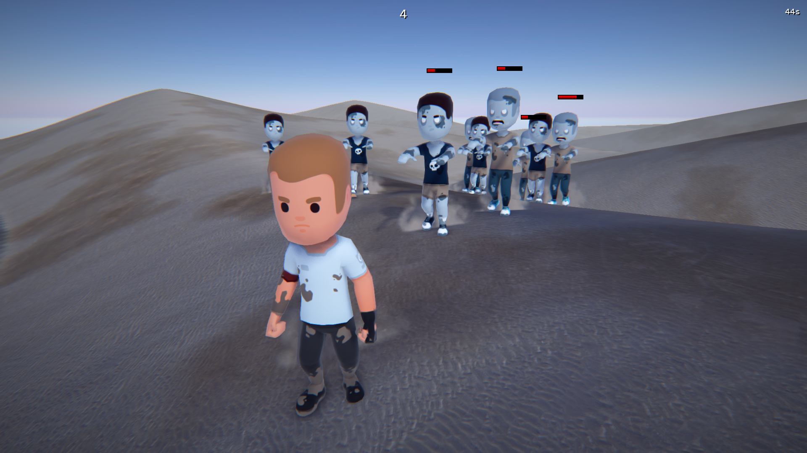
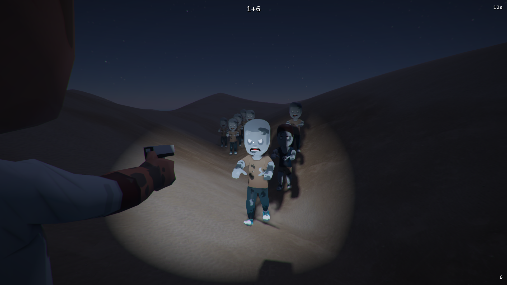
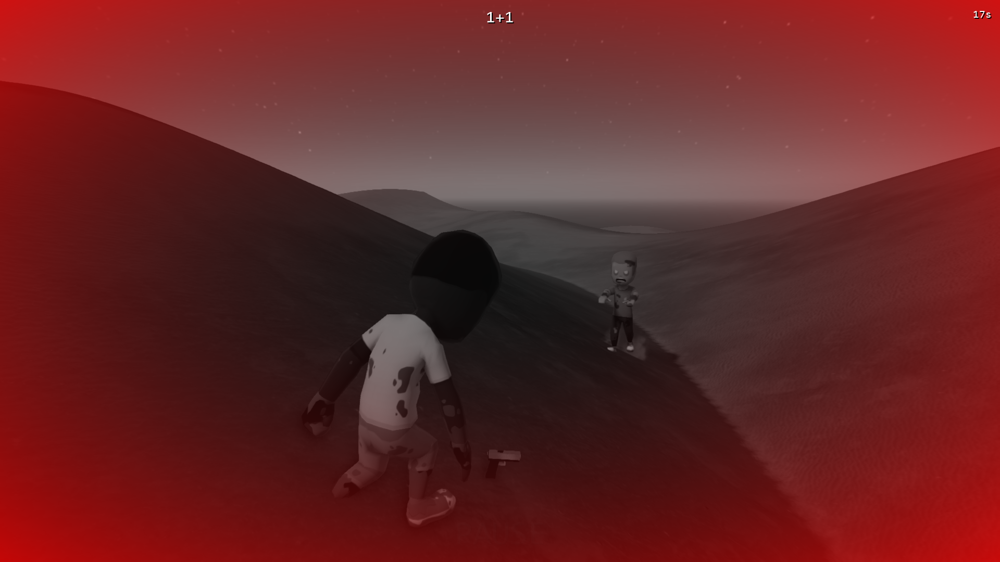

# BBMOD Zombie Demo
> Backup of the Zombie Demo project that was included in BBMOD until release 3.20.1

# Disclaimer ⚠️
This repository serves only as a backup of the demo project. It is no longer maintained or developed!

# Screenshots

# Credits
* Models by [Kenney.nl](https://www.kenney.nl/)
* Terrain textures by [Poly Haven](https://polyhaven.com/)

# Links
* [BBMOD](https://github.com/blueburncz/BBMOD)
